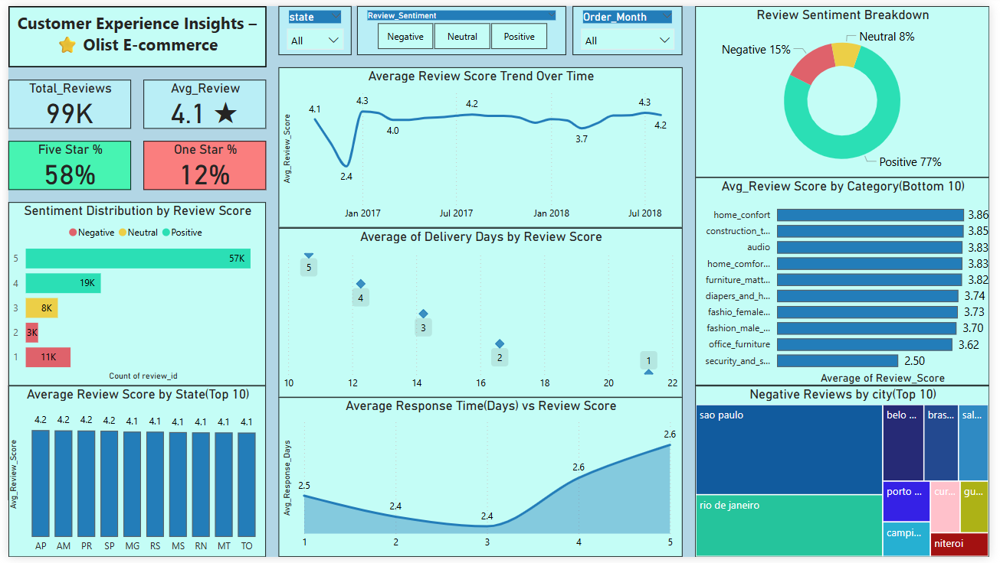
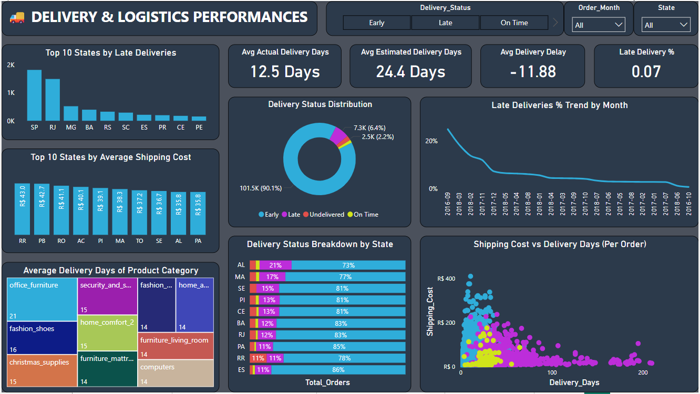
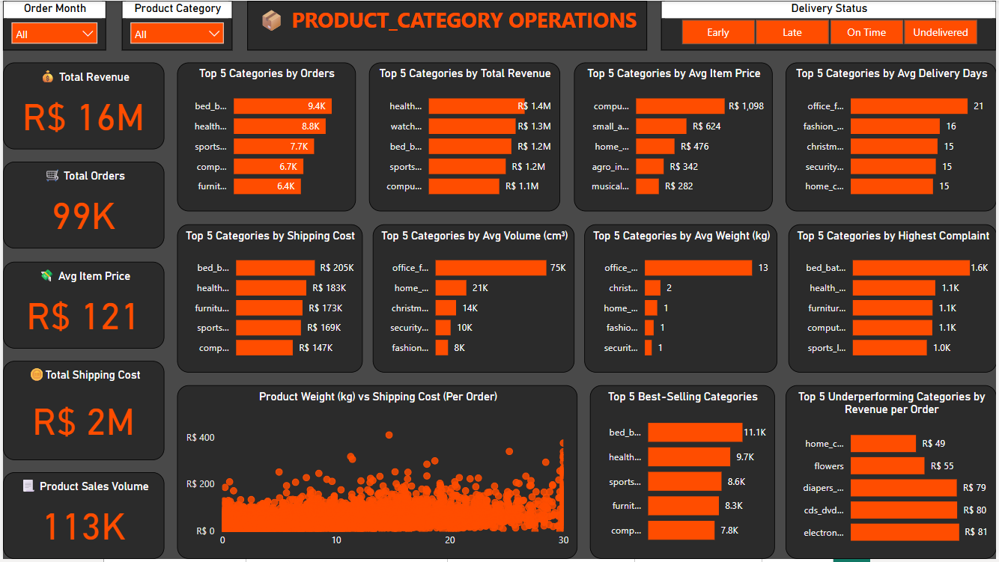
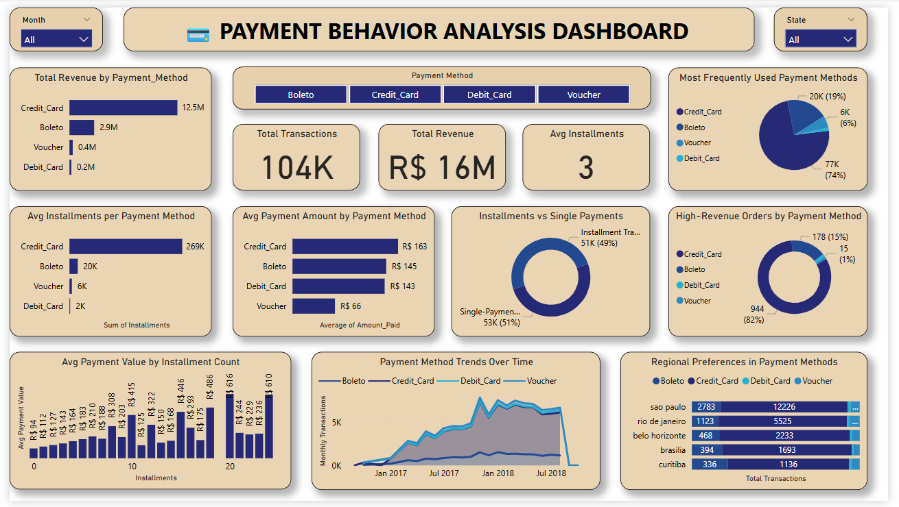

# 📊 Olist E-commerce Insights – Power BI Project

This Power BI project analyzes various aspects of the Olist e-commerce platform, covering **Customer Experience**, **Delivery & Logistics Performance**, **Product Operations**, and **Payment Behavior** using real-world data.

---

## 🧠 Project Goals
To extract advanced insights beyond just sales metrics by answering operational and behavioral business questions through interactive dashboards.

---

## 📁 Dataset Used
- Sourced from the [Olist e-commerce public dataset](https://www.kaggle.com/datasets/olistbr/brazilian-ecommerce).
- Cleaned and modeled in Power BI using 8 key tables.

---

## 📌 Dashboards Overview

### 1️⃣ Customer Experience Insights
- Average Review Score, Sentiment Analysis
- Star Rating Breakdown by Product & Region
- Review Timing & Response Trends

### 2️⃣ Delivery & Logistics Performance
- Late Deliveries %, Shipping Time Trend
- Actual vs Estimated Delivery
- Regional Delivery Insights

### 3️⃣ Product & Category Operations
- Orders vs Revenue by Category
- Shipping Cost & Weight Analysis
- Product-level Complaint Distribution

### 4️⃣ Payment Behavior Analysis
- Payment Method Preference & Revenue
- Installment vs Single Payment Breakdown
- Regional Payment Trends

---

## 🛠️ Tools Used
- **Power BI**
- **DAX**
- **Data Modeling**
- **Data Cleaning**
- **Olist E-commerce Dataset**

---

## 📷 Dashboards Preview

| Dashboard | Preview |
|----------|---------|
| Customer Experience |  |
| Delivery Performance |  |
| Product Operations |  |
| Payment Behavior |  |

---

## 📌 Author
**Alisha Mahanty**  
Aspiring Data Analyst | Excel | SQL | Power BI | Python | AI for Analytics  
[LinkedIn Profile](#) • [Portfolio Website](#)

