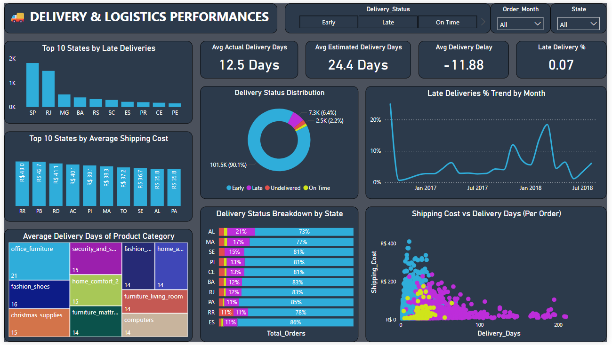

# 📊 Olist E-commerce Insights – Power BI Project

This Power BI project analyzes various aspects of the Olist e-commerce platform, covering **Customer Experience**, **Delivery & Logistics Performance**, **Product Operations**, and **Payment Behavior** using real-world data.

---

## 🧠 Project Goals
To extract advanced insights beyond just sales metrics by answering operational and behavioral business questions through interactive dashboards.

---

## 📁 Dataset Used
- Sourced from the [Olist e-commerce public dataset](https://www.kaggle.com/datasets/olistbr/brazilian-ecommerce).
- Cleaned and modeled in Power BI using 8 key tables.

---

## 📌 Dashboards Overview

### 1️⃣ Customer Experience Insights
- Average Review Score, Sentiment Analysis
- Star Rating Breakdown by Product & Region
- Review Timing & Response Trends

### 2️⃣ Delivery & Logistics Performance
- Late Deliveries %, Shipping Time Trend
- Actual vs Estimated Delivery
- Regional Delivery Insights

### 3️⃣ Product & Category Operations
- Orders vs Revenue by Category
- Shipping Cost & Weight Analysis
- Product-level Complaint Distribution

### 4️⃣ Payment Behavior Analysis
- Payment Method Preference & Revenue
- Installment vs Single Payment Breakdown
- Regional Payment Trends

---
## 📌 Key Insights

✅ **Customer Experience**  
- Over 57% of reviews are 5-star rated, with positive sentiment dominating.  
- Product categories like "health_beauty" and "sports_leisure" scored highest in satisfaction.  
- Response time to customer reviews is fastest in top-tier cities.

✅ **Delivery & Logistics**  
- Late deliveries peak during holiday months, especially in the South and Northeast regions.  
- Most delayed orders were shipped via standard delivery methods, suggesting optimization needs.  
- Average delivery takes ~10 days vs an estimate of ~8 days.

✅ **Product Operations**  
- "Bed_Bath_Table" and "Furniture" generate high revenue but also have higher complaint rates.  
- Products with higher shipping weight tend to have more complaints and longer delays.  
- Some categories generate significant volume but little profit due to low pricing.

✅ **Payment Behavior**  
- Credit card dominates transactions, contributing over 60% of revenue.  
- Installment payments are preferred for high-ticket items, especially in Southeast Brazil.  
- "Boleto" method shows high abandonment in lower-tier regions.

---

## 🛠️ Tools Used
- **Power BI**
- **DAX**
- **Data Modeling**
- **Data Cleaning**
- **Olist E-commerce Dataset**

---

## 📷 Dashboards Preview

| Dashboard | Preview |
|----------|---------|
| Customer Experience |  |
| Delivery Performance |  |
| Product Operations |  |
| Payment Behavior |  |

---

## 📊 **Power BI Dashboard:**
[Download Olist E-commerce Power BI Dashboard (.pbix)](./Olist_E-commerce_Project.pbix)

